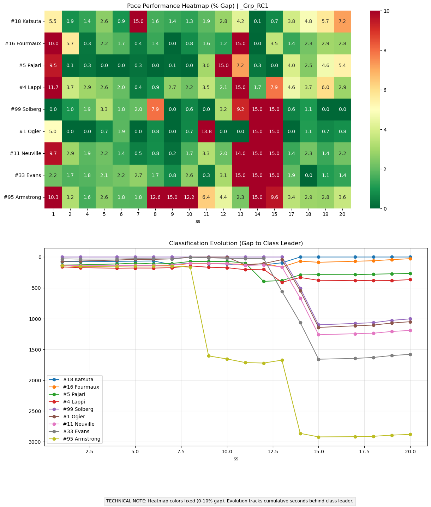
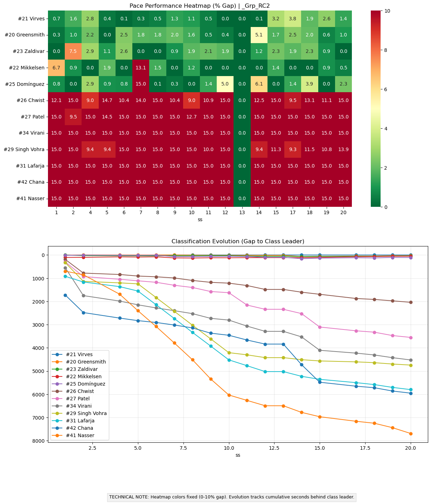
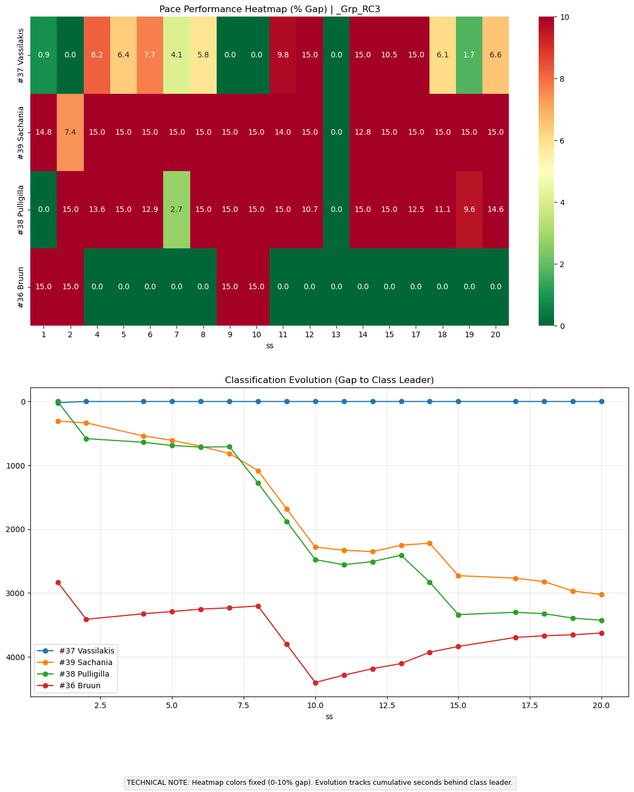
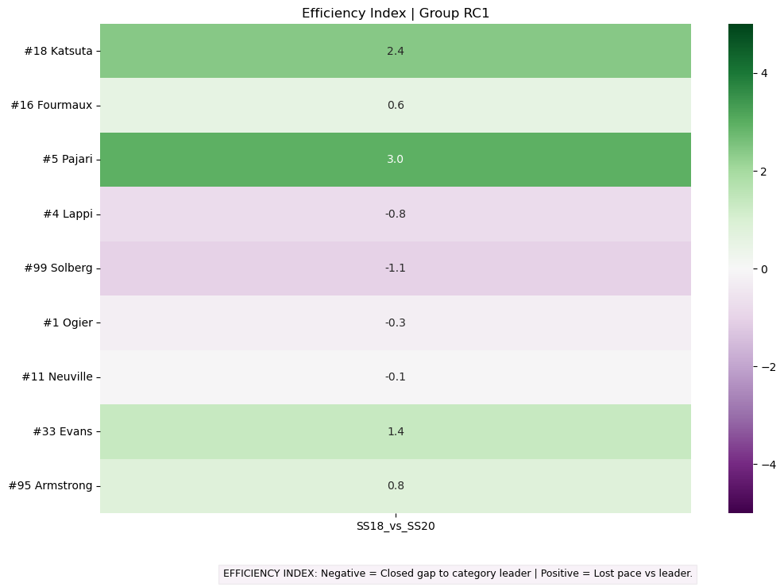
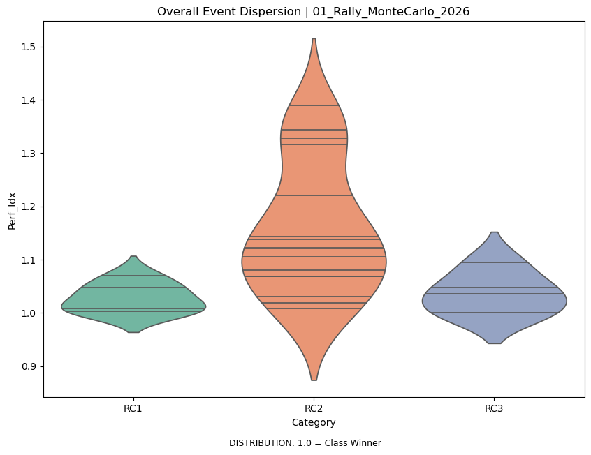
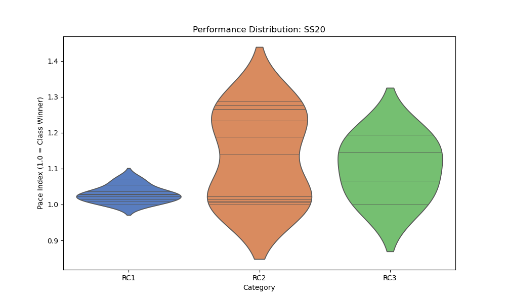
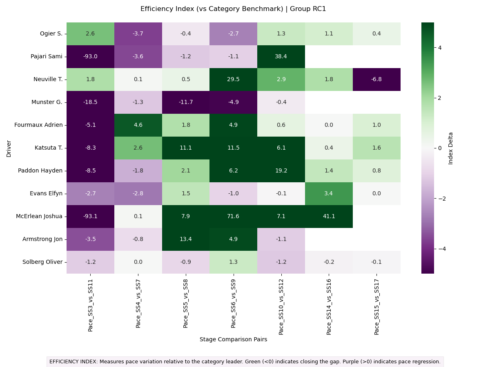
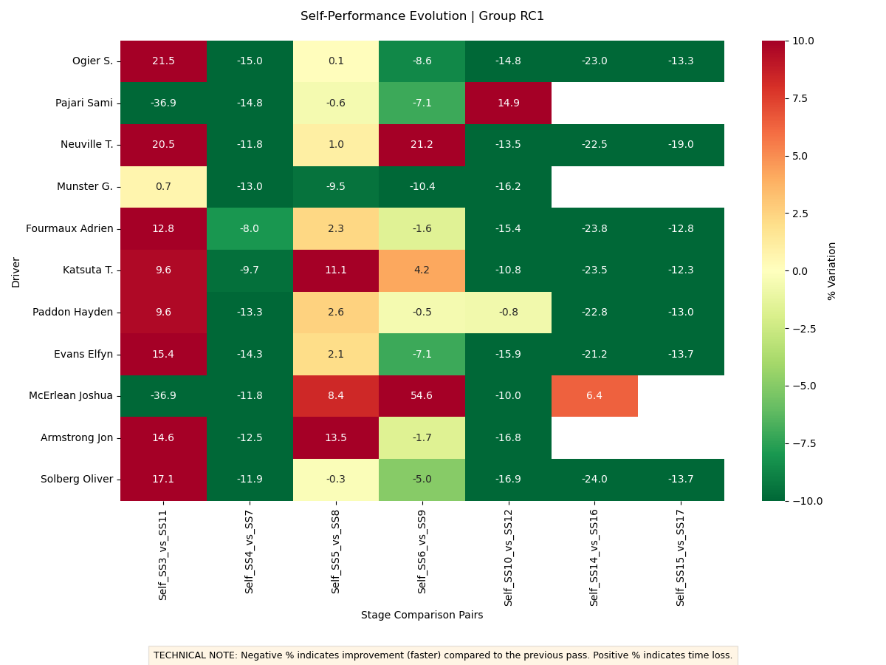
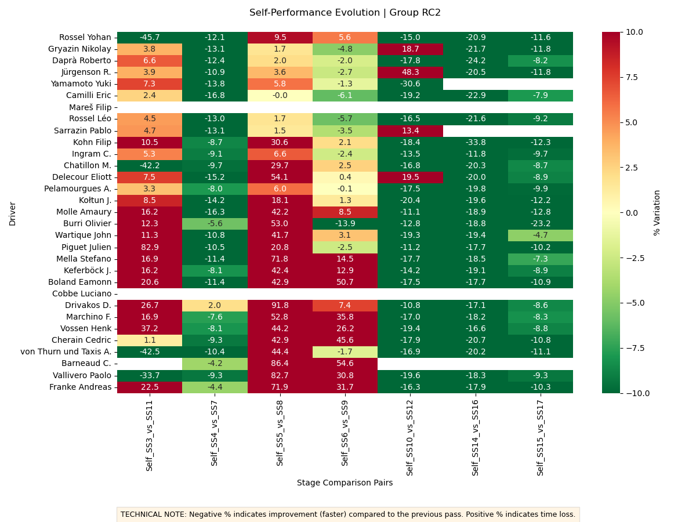

# 📊 Rally Performance Analytics (v2.3)

A technical framework for the extraction, processing, and multi-dimensional visualization of rally timing data. The system processes stage result data to generate high-resolution analytics for performance evaluation and driver auditing.

---

## 🔍 Analytical Methodology & Interpretations

### 1. Performance Dashboards & Heatmaps (% Gap)
The Dashboard is the primary tool for evaluating stage-by-stage competitiveness. It calculates the percentage time delta between each driver and the **Class Leader** (the fastest driver within the selected group).

* **Pace Heatmap (Upper Plot):** A grid-based visualization of efficiency.
    * **Dark Green (0.0% - 1.5%):** Elite pace, matching or pressuring the class leader.
    * **Yellow/Orange:** Moderate pace deviation.
    * **Red (>10.0%):** Significant time loss, mechanical failure, or road incident.
* **Classification Evolution (Lower Plot):** Tracks the cumulative time gap (in seconds) from the class leader throughout the event.
    * **Flat Line:** Pace parity with the leader.
    * **Downward Slope:** Time loss accumulation.
    * **Lines Crossing:** Change in the leaderboard positions.

| Category RC1 Analytics | Category RC2 Analytics | Category RC3 Analytics |
| :--- | :--- | :--- |
|  |  |  |

---

### 2. Efficiency Index (Pace Improvement)
This specialized analysis evaluates a driver's adaptation during repeated special stages (loops). It measures the change in a driver's **Pace Index** relative to the category benchmark.

* **Green (Negative Value):** Indicates "Positive Efficiency." The driver successfully closed the gap to the class leader compared to the previous pass.
* **Purple (Positive Value):** Indicates "Performance Regression." The driver lost ground relative to the benchmark, potentially due to tire wear, road degradation, or lack of adaptation.

| RC1 Efficiency Index | RC2 Efficiency Index |
| :--- | :--- |
|  |  |

---

### 3. Performance Density (Violin Plots)
Violin plots provide a statistical "X-ray" of the field's competitiveness and attrition.

* **Width (The Belly):** Represents driver density. A wide belly indicates a high concentration of drivers achieving nearly identical times.
* **Vertical Extension:** Indicates the spread/dispersion of the field. A "long" violin suggests significant time gaps between competitors (common in endurance rallies like Safari).
* **Internal Sticks:** Mark individual driver positions within the distribution.

| Overall Event Dispersion | Stage Specific Density (Safari Power Stage) |
| :--- | :--- |
|  |  |

---

### 4. Granular Component Analysis (Subfolder: `heatmaps_evolution`)
Dedicated charts focusing on isolated metrics for driver coaching and telemetry auditing.

* **Pace Evolution:** Visualizes the raw percentage gap consistency over the entire itinerary to monitor long-term performance trends.
* **Self Evolution:** Tracks a driver's own improvement across the event by comparing repeat passes of the same stages.
    * **Negative Values (Green):** Represent a "Learning Curve" or improved pace on the second pass.
    * **Positive Values (Red):** Indicate a decrease in speed, often due to road degradation, technical issues, or tactical tire management.

| Pace Evolution RC1 | Self Evolution RC1 | Self Evolution RC2 |
| :--- | :--- | :--- |
|  |  |  |

## ⚙️ Technical Architecture (v2.x Standards)

### Collision-Proof Identification
Version 2.3 adopts the **Competition Number (#No.)** as the primary unique key. This architectural shift prevents data merging errors in cases of identical driver surnames (e.g., Rossel, Solberg, or McRae families).

### Automated Data Tiering
The framework enforces a standardized directory hierarchy for archival and retrieval:
* **Databases:** `data/[Series]/[Sub_Series]/[Event].csv`
* **Primary Gallery:** `gallery/[Series]/[Event]/` (Core Dashboards & Stat Distributions)
* **Deep Analytics:** `gallery/[Series]/[Event]/heatmaps_evolution/` (Individual component plots)

### Data Normalization
* **Fixed Color Scales:** Normalization (0-10% for Heatmaps, -5/+5 for Efficiency) ensures that a "Deep Green" on a Tarmac rally means the same competitive level as on a Gravel rally.
* **Impersonal Reporting:** Outputs are strictly technical, utilizing neutral terminology and embedded horizontal footers (Legends) for standalone clarity.
